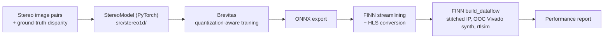
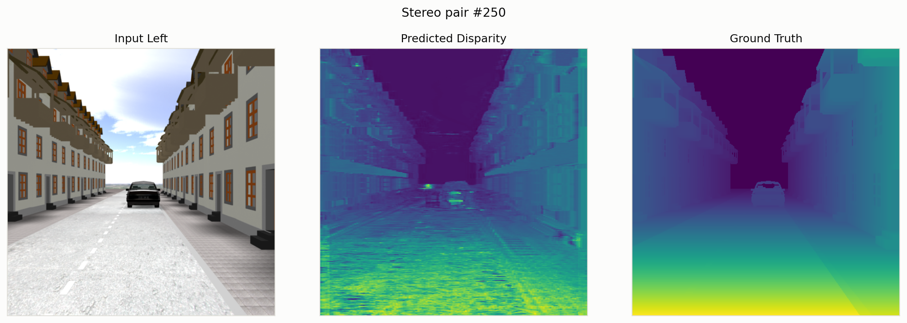
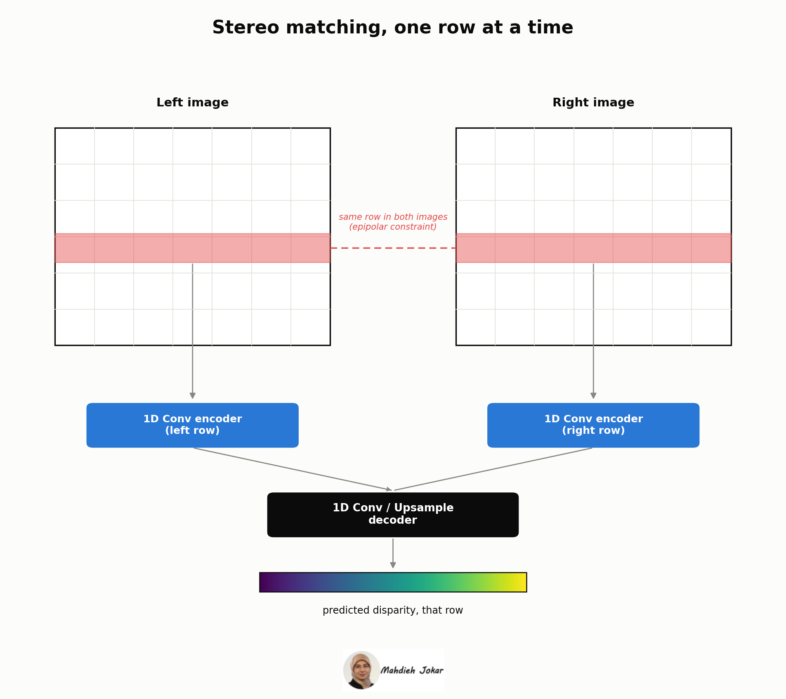

# Disp1DNet

This repository is the code and workflow behind my master's thesis, defended at the
University of Tehran in 2023. The resulting paper was published in 2024, and this repo
is the full release: the model, the training pipeline, the FPGA build artifacts, and
the numbers behind both.

**Published:** M. Jokar, "Disp1DNet: Rapid 1D Stereo Network for Efficient Disparity
Map Estimation," IEEE. [ieeexplore.ieee.org/document/10887522](https://ieeexplore.ieee.org/document/10887522/)

**Technical walkthrough (Medium article):**  
[How I Got 557 FPS Stereo Depth Running on a $300 FPGA](https://medium.com/@mjokar7676/how-i-got-557-fps-stereo-depth-running-on-a-300-fpga-3472bc59a4e)

Disp1DNet is a 1D-CNN stereo disparity model, trained end-to-end in PyTorch, quantized
with [Brevitas](https://github.com/Xilinx/brevitas), and synthesized to a Xilinx FPGA
with [FINN](https://github.com/Xilinx/finn). It runs on CPU, GPU, and FPGA with
identical accuracy, and on the FPGA it clears real-time throughput by more than 18x,
at a fraction of the cost and power a CPU or GPU would need to hit the same target.

## Pipeline



"StereoModel (PyTorch)" is the reimplemented, re-runnable part of this repo
(`src/stereo1d/`). Everything from "Brevitas quantization-aware training" onward lives
only in the notebook and in `resources/` as a historical build record; see
[Reproducibility & limitations](#reproducibility--limitations) below for why.

## Results

**Published (thesis), same model across CPU/GPU/FPGA:**

| Platform | BMP | Throughput |
|---|---|---|
| Intel Core i7-9700K (CPU) | 22% | 5 fps |
| NVIDIA RTX 2080 (GPU) | 22% | 625 fps (~1.6 ms/image) |
| Xilinx PYNQ-Z1 (FPGA) | 22% | 557 fps (~1.7 ms/image) |

Real-time only requires 30 fps for this application, so the FPGA result clears the
minimum real-time requirement by about 18.5x, at a fraction of the cost and power a CPU
or GPU would need to hit the same target.

**Published (thesis), vs. other FPGA stereo accelerators:**

| Method | Platform | BMP | Runtime | Power | Price |
|---|---|---|---|---|---|
| **Disp1DNet (ours)** | Xilinx PYNQ-Z1 | 22% | **1.7 ms** | **0.28 W** | **$300** |
| SGM (Jin & Maruyama) | Xilinx ZC706 | 9.9% | 14 ms | 3 W | $3,600 |
| ELAS | Xilinx ZC706 | 13.6% | 95 ms | 1.23 W | $3,600 |
| BNN | Altera Stratix V | 6.95% | 2.02 ms | 5.13 W | $7,000 |
| StereoEngine | Altera Stratix V | 6.37% | 6.07 ms | 3 W | $7,000 |

22% BMP was an accepted accuracy target for this project, not a shortfall. The goal was
a real-time, edge-deployable stereo model, and this result met that bar: it's the
cheapest board in the comparison by 12 to 23x, the lowest-power by 4 to 18x, and the
fastest, while every other method here is a hybrid, a neural network for one stage and
a classical algorithm for the rest. Disp1DNet is a single end-to-end network doing the
whole job. A deeper network and a larger, more diverse training set would reasonably be
expected to close the accuracy gap further while staying just as hardware-friendly,
including on FPGA specifically, which is one of the least forgiving deployment targets
there is.

**Our own reproduction**, re-running the float32 baseline in this repo
(`src/stereo1d/evaluate.py`) against the shipped checkpoint, on the real dataset's test
split (126 held-out images): mean BMP 0.189, mean RMSE 0.111. This is our own
verification run, not the thesis's hardware measurement above; see
[`docs/results.md`](docs/results.md) for the full numbers and per-image CSV.

**FINN build artifact**: `resources/finn_build_output_w2a1_64ch/` is a separate FINN
`build_dataflow` run, targeting `xc7a200t`, a different, lower-cost standalone FPGA than
the PYNQ-Z1 board the thesis table above reports on. Rtlsim throughput came out to
840,336 images/s, fmax 171.6 MHz, LUT 229,534, BRAM 50, DSP 0. This is kept as a build
artifact and reproducibility record, not the headline hardware result; see that
folder's README for the full report.

Sample predictions (`stereo1d.infer`), Input Left / Predicted Disparity / Ground Truth:



Running inference over a contiguous sequence of test-range frames:

https://github.com/user-attachments/assets/dbb6b661-3c91-4c17-99b2-70ba02b615a5

## The Motivation and Novelty Behind Disp1DNet


My starting point was an FPGA deployment target for stereo vision, and the field's
existing state-of-the-art models made that hard. They were accurate, but almost all of
them ran 2D convolutions over the full image or built a 3D cost volume and convolved
over that, which is expensive to compute and awkward to map onto FPGA resources at any
reasonable clock speed. Some were accurate on an RTX-class GPU and effectively
undeployable on the hardware the project actually needed to target. Industry didn't
need the most accurate model in the literature; it needed a model that could run on an
edge device, even if that meant trading away some accuracy for it.

I spent real time on this before settling on the 1D approach. I evaluated existing
trained stereo networks directly, including GA-Net, chosen for its citation count and
published results, and tried to bring it through an FPGA toolchain; its ONNX export
didn't work cleanly enough at the time to take further (a newer ONNX exporter version
may well handle it today). I validated that the FPGA path itself was viable with a
small MLP through FINN, which worked but generalized poorly outside its training
distribution and told me nothing about stereo matching specifically. From there I went
back to first principles: I studied the theoretical foundations of stereo
correspondence, local and global matching methods, and prototyped several of them
myself in MATLAB and Python.

That's what led to the idea this project is built on. A rectified stereo pair puts both
cameras on the same horizontal baseline, so by the epipolar constraint, a pixel's match
in the other image is guaranteed to lie on the same row. The correspondence search is
fundamentally one-dimensional, per scanline, not a two-dimensional search over the
whole image. Almost nobody in the stereo-network literature actually builds on that;
they convolve over the full 2D image or a 3D cost volume regardless. Disp1DNet takes
the epipolar constraint at face value: each row of the left and right image is fed
through its own 1D-convolution encoder, independently of every other row, then
concatenated and decoded back into a disparity row. That's a direct, structural cut in
parameters and compute relative to 2D/3D stereo networks, and it's the reason this
model is small and fast enough to synthesize onto an FPGA in the first place.

## Repository structure

```
├── src/stereo1d/        baseline pipeline: model, data loading, train/evaluate/infer CLIs
├── notebooks/           the original research notebook (training to FINN synthesis), untouched
├── model/               baseline checkpoint, see model/README.md
├── data/                dataset info and expected layout, see data/data.md (no data committed)
├── resources/           FINN build_dataflow output (historical), see its README
├── docs/                results, figures
└── scripts/             chart and video generation helpers
```

## Quickstart

```bash
pip install -e .   # or: PYTHONPATH=src

python -m stereo1d.evaluate --checkpoint model/stereo1d_baseline.pt --hidden-channels 64
python -m stereo1d.infer --checkpoint model/stereo1d_baseline.pt --indices 210 250 300
python -m stereo1d.train --epochs 30 --output model/my_run.pt   # or --resume-from <ckpt>
```

All three expect the dataset laid out as described in **[`data/data.md`](data/data.md)**;
it isn't included here, since it's third-party. Download it yourself and drop it in.

## Reproducibility & limitations

- `src/stereo1d/` (data loading, training, evaluation, inference) is fully re-runnable
  with a normal PyTorch environment, given the dataset locally.
- Brevitas quantization and FINN/Vivado FPGA synthesis, the rest of the pipeline
  diagram above, cannot currently be re-executed. The FINN Docker environment itself
  is still a real, available toolchain; I just no longer have access to the specific
  system it was set up on. `notebooks/disp1dnet_training_and_finn_synthesis.ipynb` and
  `resources/finn_build_output_w2a1_64ch/` are kept as a historical record of that run,
  not a reproducible pipeline.
- The notebook is exploratory research code and is included as-is, unedited: it has a
  few dead-end/error cells from architecture experiments, left in for transparency.

## Citation

Article: M. Jokar, "Disp1DNet: Rapid 1D Stereo Network for Efficient Disparity Map
Estimation," IEEE, 2024. https://ieeexplore.ieee.org/document/10887522/ (see
[`CITATION.cff`](CITATION.cff); the article PDF itself isn't included here, IEEE holds
the copyright on the typeset version).

Thesis: M. Jokar, Master's thesis, University of Tehran, 2023 (Farsi). Not included in
this repo.

## License

Code (`src/`, `notebooks/`, `scripts/`) is MIT-licensed; see [`LICENSE`](LICENSE). The
article is linked only, not redistributed (IEEE holds copyright); the dataset is
third-party and not redistributed here (see `data/data.md`); the thesis is not
included.
