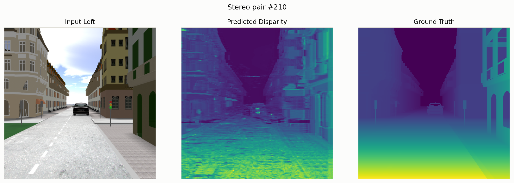
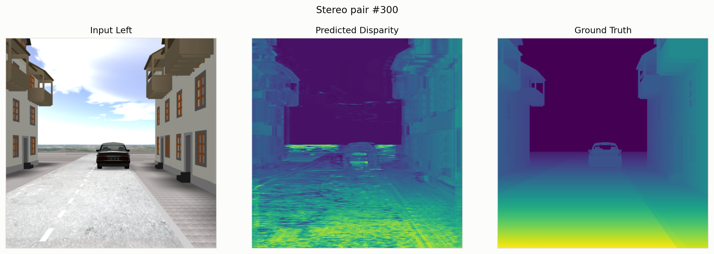
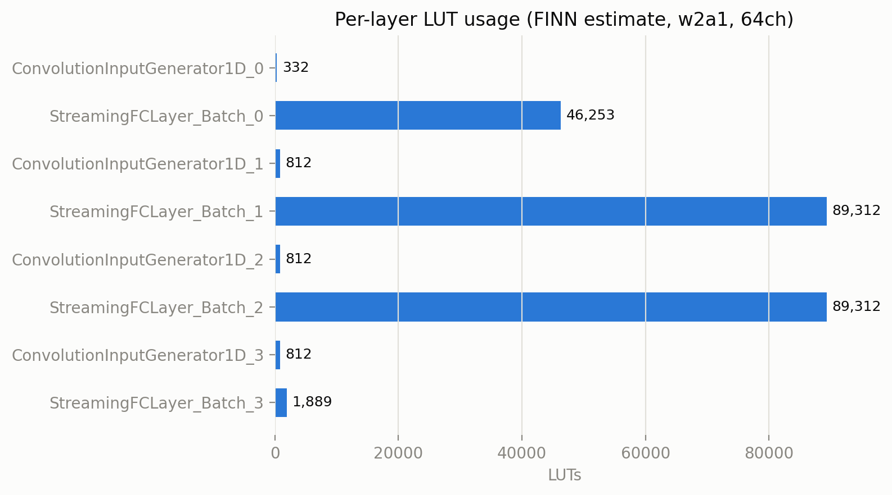

# Results

## Baseline pipeline (PyTorch, float32, `src/stereo1d/`)

Evaluated with `stereo1d.evaluate` against the shipped checkpoint
(`model/stereo1d_baseline.pt`, `hidden_channels=64`) over the paper's test split
(image indices 200–325, 126 images), on the real dataset:

| Metric | Mean | Std |
|---|---|---|
| BMP (bad-matching-pixel ratio, τ=0.1) | 0.189 | 0.049 |
| RMSE | 0.111 | 0.022 |
| Inference time / image (GPU) | ~31 ms | n/a |

Full per-image numbers: [`eval_test_range.csv`](eval_test_range.csv).

Sample predictions (`stereo1d.infer`): Input Left / Predicted Disparity / Ground Truth:

## FPGA synthesis (FINN, quantized, `resources/finn_build_output_w2a1_64ch/`)

From the FINN `build_dataflow` reports (Xilinx Artix-7 `xc7a200t`, 100 MHz target
clock). See `resources/finn_build_output_w2a1_64ch/README.md` for the full layout:

| Metric | Value |
|---|---|
| rtlsim throughput | 840,336 images/s |
| Estimated throughput (pre-synthesis) | ~1.49M FPS |
| fmax (out-of-context synthesis) | 171.6 MHz |
| LUT (total) | 229,534 |
| BRAM (18K) | 50 |
| DSP / URAM | 0 / 0 |

Per-layer LUT breakdown:

## Published numbers (for comparison)

| Source | Metric | Value |
|---|---|---|
| IEEE article (GPU, RTX 2080) | BMP / throughput | 22% / 625 images/s (~1.6 ms/image) |
| Thesis (FPGA-synthesized) | error / throughput | 22% / 557 images/s (~18.5× real-time) |

The baseline pipeline's re-measured BMP (0.189) and the article's headline BMP (0.22)
aren't expected to match exactly. These are different runs, with evaluation code that's
been rewritten (see `src/stereo1d/evaluate.py`'s docstring for the two correctness
fixes relative to the original notebook cells). Both are well within the same ballpark.
